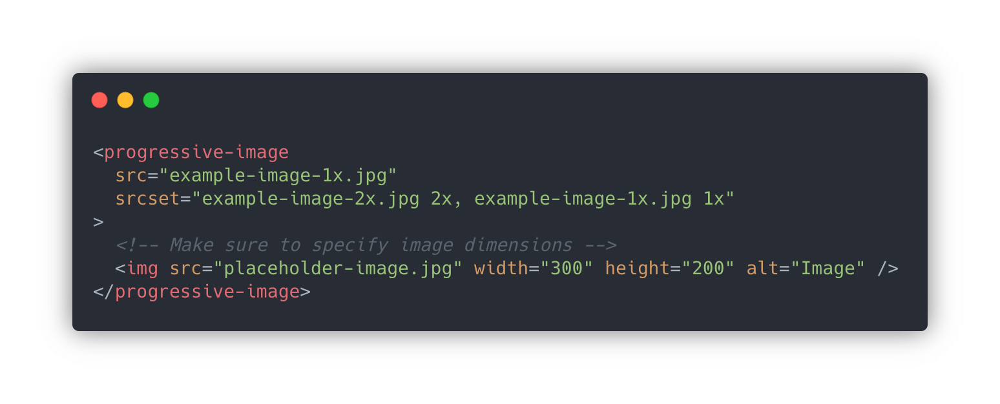

# &lt;progressive-image&gt; element

> A progressive image element

[](https://github.com/andreruffert/progressive-image-element/actions?workflow=CI)
[](https://www.npmjs.com/package/progressive-image-element)

Progressively enhance image placeholders once they are in the viewport.

* Responsive lazy loading images
* Save data option
* No content reflow/layout shifting
* No dependencies
* Framework agnostic

<div align="center">
  
</div>


## Install

```console
$ npm install progressive-image-element
```


## Usage

1. Include the script & stylesheet within your application

  ```html
  <!-- Include the stylesheet, this could be direct from the package or CDN -->
  <link rel="stylesheet" href="https://unpkg.com/progressive-image-element@latest/dist/progressive-image-element.css" />

  <!-- Include the custom element script, this could be direct from the package or CDN -->
  <script src="https://unpkg.com/progressive-image-element@latest/dist/index.js"></script>
  ```

  or

  ```js
  // Import the custom element script
  import ProgressiveImageElement from 'progressive-image-element';
  ```

2. Use the `<progressive-image>` element markup

  ```html
  <progressive-image
    src="example-image-1x.jpg"
    srcset="example-image-2x.jpg 2x, example-image-1x.jpg 1x"
  >
    <!-- Make sure to specify image dimensions -->
    
  </progressive-image>
  ```
  The placeholder image should be a solid color placeholder, [LQIP](http://www.guypo.com/introducing-lqip-low-quality-image-placeholders) or [SQIP](https://github.com/technopagan/sqip) that hint at the content of the progressive image before it loads.

## Attributes

- `src` Specifies the image to display
- `srcset` One or more [image candidate strings](https://developer.mozilla.org/en-US/docs/Web/API/HTMLImageElement/srcset)
- `sizes` Comma-separated list of [source size descriptors](https://developer.mozilla.org/en-US/docs/Web/API/HTMLImageElement/sizes)
- `savedata` Boolean attribute to load the images only after a click/tap on the placeholder image

## Styling states

A CSS class `loadable` is present on `<progressive-image>` when the image is ready to load on user interaction (`click`).
Used for slow connections or when the `savedata` attribute is present.
```css
progressive-image.loadable { ... }
```

A CSS class `[loading]` is present on `<progressive-image>` while the image is loading.
```css
progressive-image.loading { ... }
```

A CSS class `.loaded` is present on `` children of `<progressive-image>` when the image was loaded.
```css
progressive-image > img { opacity: 0; }
progressive-image > img.loaded { opacity: 1; }
```


## Examples
- [Example page](https://andreruffert.github.io/progressive-image-element/examples)
- [Simple fadeIn transition - CodePen](https://codepen.io/andreruffert/full/mdyZLrQ)
- [Save data option with loading state - CodePen](https://codepen.io/andreruffert/full/yLydrdb)
- [React Component - CodePen](https://codepen.io/andreruffert/full/KKpKVRO)


## Browser support

Browsers without native [custom element support][support] require a [polyfill][].

[support]: https://caniuse.com/#feat=custom-elementsv1
[polyfill]: https://github.com/webcomponents/polyfills/tree/master/packages/custom-elements


## License

MIT © [André Ruffert](https://andreruffert.com)
